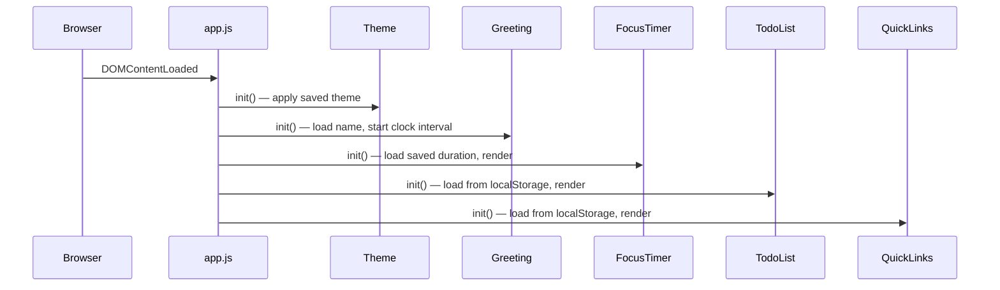

# Design Document: Personal Dashboard

## Overview

A single-page personal dashboard built with plain HTML, CSS, and Vanilla JavaScript. It runs entirely in the browser with no build step or backend. All state is persisted via the browser's `localStorage` API. The app is structured as a single `index.html` entry point, one stylesheet (`css/style.css`), and one script (`js/app.js`).

The four widgets — Greeting, Focus Timer, To-Do List, and Quick Links — are each self-contained logical modules within `app.js`, sharing a thin persistence layer that wraps `localStorage`. Three enhancements extend the base spec: light/dark mode theming (Theme module), a custom user name in the greeting, and a configurable Pomodoro timer duration.

---

## Architecture

The app follows a simple module-per-widget pattern inside a single script file. There is no framework, no bundler, and no module system — just plain ES2020 JavaScript loaded as a classic script.

```
index.html
├── css/
│   └── style.css
└── js/
    └── app.js
        ├── Storage module      (localStorage read/write helpers)
        ├── Theme module        (light/dark toggle + persistence)
        ├── Greeting module     (time/date display + greeting + custom name)
        ├── FocusTimer module   (configurable countdown timer state machine)
        ├── TodoList module     (task CRUD + persistence)
        └── QuickLinks module   (link CRUD + persistence)
```

Initialization flow:



---

## Components and Interfaces

### Storage Module

Thin wrapper around `localStorage` with JSON serialization.

```js
Storage.get(key)          // → parsed value or null
Storage.set(key, value)   // serializes and writes
```

Keys used:
- `"pd_tasks"` — array of Task objects
- `"pd_links"` — array of Link objects
- `"pd_theme"` — string: `"light"` or `"dark"`
- `"pd_name"`  — string: user's custom name
- `"pd_timer_duration"` — number: timer duration in minutes

### Theme Module

Manages the active colour scheme by toggling a `data-theme` attribute on `<html>`.

```js
Theme.init()       // reads saved theme from Storage, applies it, binds toggle button
Theme.toggle()     // switches between "light" and "dark", persists to Storage
Theme.apply(theme) // sets data-theme attribute on <html> element
```

CSS uses `[data-theme="dark"]` selectors to override custom properties for the dark palette.

### Greeting Module

Reads `new Date()` on init and every 60 seconds via `setInterval`. Also manages the custom name input.

```js
Greeting.init()            // loads name from Storage, starts interval, renders immediately, binds name input
Greeting.render(date)      // updates DOM: time, date string, greeting text (with name if set)
Greeting.getGreeting(hour) // pure fn: hour (0–23) → greeting string
Greeting.formatTime(date)  // pure fn: Date → "HH:MM"
Greeting.formatDate(date)  // pure fn: Date → "Weekday, Month DD YYYY"
Greeting.saveName(name)    // persists name to Storage, re-renders greeting
```

### FocusTimer Module

Manages a configurable countdown state machine with three states: `idle`, `running`, `paused`. Duration is user-configurable and persisted.

```js
FocusTimer.init()                  // loads saved duration, renders, binds button and duration input events
FocusTimer.start()                 // idle/paused → running, starts setInterval(tick, 1000)
FocusTimer.stop()                  // running → paused, clears interval
FocusTimer.reset()                 // any → idle, clears interval, restores to configured duration
FocusTimer.tick()                  // decrements seconds, stops at 00:00
FocusTimer.setDuration(minutes)    // validates (1–99), persists to Storage, resets display
FocusTimer.formatTime(totalSeconds) // pure fn: number → "MM:SS"
```

### TodoList Module

```js
TodoList.init()           // loads from storage, renders all tasks
TodoList.add(label)       // validates, creates Task, persists, renders
TodoList.edit(id, label)  // validates, updates Task, persists, re-renders item
TodoList.toggle(id)       // flips completion state, persists, re-renders item
TodoList.delete(id)       // removes Task, persists, removes DOM node
TodoList.save()           // writes current task array to Storage
TodoList.render()         // rebuilds task list DOM from state
```

### QuickLinks Module

```js
QuickLinks.init()         // loads from storage, renders all links
QuickLinks.add(label, url) // validates, creates Link, persists, renders
QuickLinks.delete(id)     // removes Link, persists, removes DOM node
QuickLinks.save()         // writes current link array to Storage
QuickLinks.render()       // rebuilds links DOM from state
```

---

## Data Models

### Task

```js
{
  id: string,        // crypto.randomUUID() or Date.now().toString()
  label: string,     // non-empty task description
  completed: boolean // false by default
}
```

### Link

```js
{
  id: string,   // crypto.randomUUID() or Date.now().toString()
  label: string, // non-empty display label
  url: string    // non-empty URL string (validated with URL constructor)
}
```

### Persistence Format

Both collections are stored as JSON arrays under their respective keys. Scalar preferences (`pd_theme`, `pd_name`, `pd_timer_duration`) are stored as plain JSON values. On load, if a key is absent or unparseable, the module defaults to its built-in default value.

---

## Correctness Properties

*A property is a characteristic or behavior that should hold true across all valid executions of a system — essentially, a formal statement about what the system should do. Properties serve as the bridge between human-readable specifications and machine-verifiable correctness guarantees.*

### Property 1: Greeting message covers all hours

*For any* hour value in the range 0–23, `Greeting.getGreeting(hour)` SHALL return exactly one of "Good morning", "Good afternoon", "Good evening", or "Good night", and the mapping SHALL be consistent with the hour ranges defined in Requirements 1.3–1.6.

**Validates: Requirements 1.3, 1.4, 1.5, 1.6**

### Property 2: Time formatting round-trip

*For any* `Date` object, `Greeting.formatTime(date)` SHALL return a string matching the pattern `HH:MM` where HH is zero-padded hours (00–23) and MM is zero-padded minutes (00–59).

**Validates: Requirements 1.1**

### Property 3: Timer format correctness

*For any* integer number of seconds in the range 0–1500 (0 to 25 minutes), `FocusTimer.formatTime(seconds)` SHALL return a string matching `MM:SS` where both components are zero-padded and the value correctly represents the input.

**Validates: Requirements 2.7**

### Property 4: Timer countdown never goes below zero

*For any* sequence of `tick()` calls on a running timer, the displayed seconds value SHALL never fall below 0, and the timer SHALL stop automatically when it reaches 0.

**Validates: Requirements 2.6**

### Property 5: Task addition round-trip

*For any* non-empty task label, after calling `TodoList.add(label)`, the task SHALL appear in the in-memory list and the value written to `localStorage` SHALL contain a task with that label.

**Validates: Requirements 3.1, 3.9**

### Property 6: Empty task label rejection

*For any* string composed entirely of whitespace (including the empty string), `TodoList.add(label)` SHALL reject the submission and leave the task list unchanged.

**Validates: Requirements 3.2**

### Property 7: Task toggle is an involution

*For any* task, toggling its completion state twice SHALL return it to its original completion state.

**Validates: Requirements 3.6, 3.7**

### Property 8: Task edit preserves identity

*For any* task and any non-empty new label, after `TodoList.edit(id, newLabel)`, the task with that id SHALL have the updated label and all other fields SHALL remain unchanged.

**Validates: Requirements 3.4**

### Property 9: localStorage persistence round-trip

*For any* collection of tasks written via `TodoList.save()`, reading back from `localStorage` and parsing SHALL produce an equivalent collection.

**Validates: Requirements 3.9, 3.10**

### Property 10: Link addition round-trip

*For any* non-empty label and valid URL, after `QuickLinks.add(label, url)`, the link SHALL appear in the in-memory list and the value written to `localStorage` SHALL contain a link with that label and URL.

**Validates: Requirements 4.1, 4.5**

### Property 11: Empty label or URL rejection

*For any* submission where the label or URL is empty, `QuickLinks.add(label, url)` SHALL reject the submission and leave the link list unchanged.

**Validates: Requirements 4.2**

### Property 12: Theme toggle is an involution

*For any* initial theme value, toggling the theme twice SHALL return the Dashboard to the original theme.

**Validates: Requirements 6.2**

### Property 13: Theme persistence round-trip

*For any* theme value saved via `Theme.toggle()`, reading back from `localStorage` SHALL produce the same theme string.

**Validates: Requirements 6.4, 6.5**

### Property 14: Custom name persistence round-trip

*For any* non-empty name string saved via `Greeting.saveName(name)`, reading back from `localStorage` SHALL produce the same name, and the greeting text SHALL contain that name.

**Validates: Requirements 1.7, 1.10, 1.11**

### Property 15: Timer duration bounds

*For any* integer input to `FocusTimer.setDuration(minutes)`, if the value is outside the range 1–99 the call SHALL be rejected and the duration SHALL remain unchanged; if within range the duration SHALL be updated and persisted.

**Validates: Requirements 2.8, 2.9**

---

## Error Handling

| Scenario | Handling |
|---|---|
| `localStorage` unavailable (private browsing, quota exceeded) | Wrap reads/writes in try/catch; app continues in-memory without persistence |
| Unparseable JSON in `localStorage` | Default to built-in default value; overwrite on next save |
| Invalid URL in Quick Links | Validate with `new URL(value)` in a try/catch; show inline error, reject submission |
| Empty task/link label | Trim whitespace, check length > 0; show inline validation message |
| Timer already running when start is pressed | No-op; guard with state check |
| Timer duration out of range (< 1 or > 99) | Show inline error, reject update, retain current duration |
| `crypto.randomUUID` unavailable | Fall back to `Date.now().toString() + Math.random()` |

---

## Testing Strategy

### Unit Tests (example-based)

Focus on concrete scenarios and edge cases:

- `Greeting.getGreeting` returns correct string for boundary hours (0, 5, 12, 18, 22)
- `Greeting.formatTime` zero-pads single-digit hours and minutes
- `FocusTimer.formatTime` handles 0 seconds, 60 seconds, 1500 seconds
- `TodoList.add` rejects empty string and whitespace-only strings
- `TodoList.edit` rejects empty label, retains previous label
- `QuickLinks.add` rejects missing label or missing URL
- `Storage.get` returns null when key is absent
- `Storage.get` returns null when stored value is invalid JSON

### Property-Based Tests

Use a property-based testing library (e.g., [fast-check](https://github.com/dubzzz/fast-check) for JavaScript) with a minimum of 100 iterations per property.

Each test is tagged with its design property for traceability:

| Tag format | `// Feature: personal-dashboard, Property N: <property text>` |
|---|---|

Properties to implement as PBT:

- **Property 1** — Generate hours 0–23, assert `getGreeting` returns one of the four valid strings and matches the correct range
- **Property 2** — Generate arbitrary `Date` objects, assert `formatTime` output matches `/^\d{2}:\d{2}$/`
- **Property 3** — Generate integers 0–1500, assert `formatTime` output matches `/^\d{2}:\d{2}$/` and decodes back to the input value
- **Property 4** — Simulate tick sequences, assert seconds never go negative and timer halts at zero
- **Property 5** — Generate non-empty strings, add as task, assert list length increases by 1 and localStorage contains the label
- **Property 6** — Generate whitespace-only strings, assert add is rejected and list is unchanged
- **Property 7** — Generate tasks, toggle twice, assert completion state is unchanged
- **Property 8** — Generate tasks and non-empty labels, edit, assert label updated and id/completed unchanged
- **Property 9** — Generate task arrays, save then reload, assert deep equality
- **Property 10** — Generate non-empty labels and valid URLs, add link, assert list and localStorage contain the entry
- **Property 11** — Generate submissions with empty label or empty URL, assert rejection and list unchanged

### Integration / Smoke Tests

- Dashboard renders all four widgets on page load (smoke)
- Tasks persisted in one session are present after simulated reload (integration)
- Links persisted in one session are present after simulated reload (integration)
